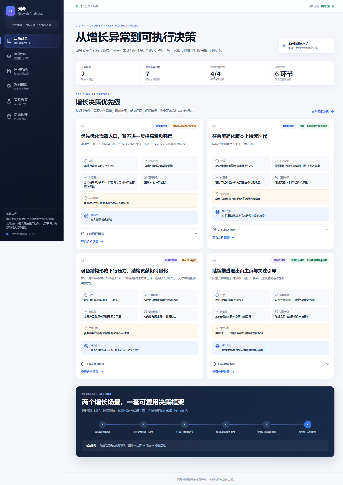
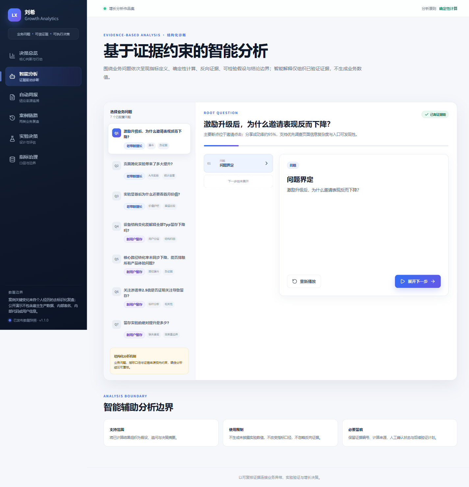
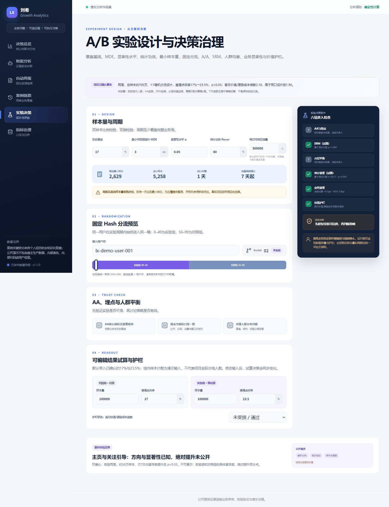

# 刘希｜增长分析与实验决策作品集

**Liu Xi Growth Analytics Portfolio**

[](https://github.com/liu-XI71/liu-xi-growth-analytics-portfolio/actions/workflows/ci.yml)
[](https://liu-xi71.github.io/liu-xi-growth-analytics-portfolio/)
[](LICENSE)

以指标合同统一口径，以确定性计算生成证据，以受约束的智能解释支持业务决策。作品围绕老带新获客和新用户留存两个增长场景，呈现从异常识别、诊断拆解、假设形成、A/B 实验到价值评估与持续监测的完整链路。

**在线体验：** [打开刘希的增长分析作品集](https://liu-xi71.github.io/liu-xi-growth-analytics-portfolio/)



## 项目价值

本项目重点展示数据分析师的业务判断与方法沉淀，而非技术组件数量：

- 将最终业务指标、机制指标、诊断指标和护栏指标纳入同一指标体系；
- 使用分层、漏斗、结构变动分解、标杆用户分析和反向证据逐步收敛问题；
- 将观察性关联转化为可检验假设，再通过随机实验识别策略效果；
- 同时评估统计显著性、业务显著性与价值护栏，支持上线与持续迭代决策；
- 自动生成来源可追溯的分析周报，并严格区分事实、推断、实验结果和数据缺口。

## 两个业务案例

| 场景 | 业务问题 | 分析路径 | 决策结果 |
|---|---|---|---|
| 老带新获客增长 | 外部拉新供给承压，激励升级后邀请点击率由约 21% 降至 17% | 指标链路定位邀请环节；约 95% 分享成功率作为反向证据；提出页面信息复杂度与入口可发现性假设；设计两周、总样本约 700 万的 A/B 实验 | 实验组邀请点击率为 23.5%，较对照组提升 6.5 个百分点（约 +38.2%），`p < 0.05`；首月价值/激励成本倍数为 2.18，高于同口径外投的 1.90，支持持续迭代与监测 |
| 新用户留存 | 投放新增用户的次 7 日内留存率由 48% 降至 41% | 用户分层识别设备结构压力；核心路径转化率未同步下降形成反向证据；标杆用户关注渗透约为非标杆用户的 2.5 倍，仅作为相关性线索；设计退出页主页与关注引导实验 | 实验运行两周、总样本约 30 万，次 7 日内留存率显著提升，`p < 0.05`；由于组间绝对留存率未披露，作品不报告绝对效果量 |

> 数据边界：项目变化来自去标识化经历复盘；行级明细和部分结构占比由固定规则生成，仅用于展示计算与交互。作品不包含雇主生产数据、内部表名、生产代码、用户信息或系统凭证。

## 六个功能页面

| 页面 | 展示能力 |
|---|---|
| 决策总览 | 将异常、影响、反向证据、证据等级、剩余不确定性与建议行动统一为决策卡 |
| 智能分析 | 按“问题—指标—计算—反向证据—假设—实验—边界”逐步展开分析链路 |
| 自动周报 | 对比案例阶段，区分系统计算、智能解释与人工确认，并支持 Markdown 导出 |
| 案例链路 | 交互式回放两个项目从监控发现到策略评估的完整过程 |
| 实验决策 | 计算最小样本量与建议周期，演示固定 Hash 分流、A/A、SRM、人群均衡、效果量与价值护栏 |
| 指标治理 | 集中管理指标分子、分母、窗口、粒度、证据来源、适用结论与使用限制 |





## 可复用分析框架

```text
业务目标与指标体系
        ↓
异常监测与问题定义
        ↓
分层 / 漏斗 / 结构分解
        ↓
反向证据与剩余不确定性
        ↓
观察性线索与可检验假设
        ↓
A/B 实验与因果识别
        ↓
统计显著性 + 业务显著性 + 价值护栏
        ↓
行动决策、自动周报与持续监测
```

## 分析治理设计

- **指标合同**：每个关键指标明确分子、分母、观察窗口、统计粒度和决策用途。
- **证据分层**：监控事实、描述性分析、观察性关联、随机实验与建议行动采用不同结论强度。
- **反向证据**：高位分享成功率与未同步下降的核心路径转化率用于降低对应方向的调查优先级，但不作绝对排除。
- **输入完整性**：缺少分期设备占比时不量化真实结构贡献；缺少组间绝对留存率时不报告绝对效果量。
- **实验决策**：统计显著性、MDE、分流质量、人群均衡、业务显著性和价值护栏共同构成决策依据。
- **来源追溯**：数值由确定性程序计算，智能解释仅组织既有证据，并保留来源与适用边界。

## 本地运行

最简方式是使用 Docker Desktop：

```bash
docker compose up --build
```

启动后打开：

- 前端：`http://localhost:8501`
- API 文档：`http://localhost:8000/docs`

停止服务：

```bash
docker compose down
```

也可以直接使用 GitHub Pages；在线版本无需安装、登录或配置模型密钥。

## 项目结构

```text
analytics/          指标、漏斗、结构分解、实验与证据约束分析
backend/            FastAPI 服务与 DuckDB 查询层
data/               去标识化事实合同、指标口径与分流契约
web/                六页 React 可视化工作台
scripts/            演示数据、静态分析包、周报与发布包生成
tests/              统计、接口、数据质量与业务边界验证
docs/               案例复盘、方法论、架构、数据卡和浏览说明
```

## 文档

- [中文使用指南](README_zh.md)
- [老带新增长案例](docs/case-study-referral.md)
- [新用户留存案例](docs/case-study-retention.md)
- [增长分析方法论](docs/growth-methodology.md)
- [A/B 实验说明](docs/experimentation-guide.md)
- [指标口径字典](docs/metric-dictionary.md)
- [数据与事实边界](docs/data-card.md)
- [智能分析治理](docs/ai-governance.md)
- [作品浏览说明](docs/portfolio-review-guide_zh.md)

## 许可与声明

代码采用 [MIT License](LICENSE)。项目为刘希的个人数据分析作品，不代表字节跳动、小红书或其他公司的官方系统、页面或业务结论；详细边界见 [DISCLAIMER.md](DISCLAIMER.md)。
