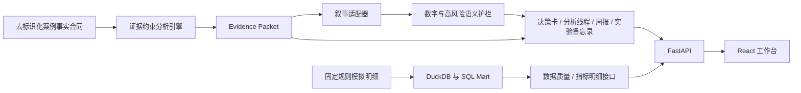

# 系统架构

## 业务目标

系统将重复的数据分析工作固化为一条可验证流程：

```text
监控异常 → 口径确认 → 确定性诊断 → 证据分级 → 假设 → 实验 → 价值护栏 → 决策周报
```

技术选型只服务于三个结果：计算可复现、结论可追溯、公开演示可稳定访问。

## 总体架构



案例事实与模拟行级数据是两条明确分开的路径：公开项目结论只来自事实合同；DuckDB 用于展示可复现的数据建模、SQL 分析与质量接口，不会反向生成或改写经历事实。

## 七层设计

| 层 | 责任 | 失败时处理 |
|---|---|---|
| 数据输入 | 区分案例事实合同与固定规则模拟明细 | 不允许静默换数或跨层混同 |
| 数据质量 | 检查完整性、唯一性、范围与新鲜度 | 测试与发布工作流失败 |
| 指标合同 | 统一分子、分母、窗口、粒度和允许维度 | 拒绝模糊问题 |
| 分析引擎 | 计算趋势、漏斗、实验和价值；结构输入不足时返回缺口 | 返回可复核错误 |
| 证据包 | 保存数字、公式、来源、单位和结论边界 | 缺证据不生成事实 |
| 叙事与验证 | 组织文字并检查数字与本项目高风险语义 | 回退确定性模板 |
| 产品界面 | 呈现分析线程、周报、实验和证据 | 保持公开模式可用 |

## 公开模式

构建前由 Python 导出 `web/public/data/growth-analytics.json`。GitHub Pages 只读取该预校验分析包：

- 不保存 API Key；
- 不连接雇主系统；
- 不接收任意上传；
- 不依赖模型在线状态；
- 所有筛选、分析步骤、实验计算、证据展开和报告下载由真实前端逻辑完成。

## 本地模式

本地模式提供：

- FastAPI 业务接口；
- DuckDB 数据库；
- 重新生成的演示数据；
- 确定性分析和 Claim 校验；
- 可选 Ollama 叙事适配器；
- 与公开数据包同构的 API 响应。

本地 React 前端优先读取 FastAPI 完整数据包；API 失败时再读取构建期静态快照。GitHub Pages 不设置 API 地址，直接读取静态快照。DuckDB 支撑本地指标明细、分析与质量接口；增长分析数据包由独立的案例事实合同生成，两者在 FastAPI 汇合但保持来源边界。

即使 Ollama 未配置、超时或输出不符合合同，确定性结果和页面仍然完整。

## 数据接口

主要接口：

```text
GET  /api/v1/analytics/bundle
GET  /api/v1/analytics/overview
GET  /api/v1/analytics/questions
GET  /api/v1/analytics/analysis/{analysis_id}
GET  /api/v1/analytics/weekly-reports
POST /api/v1/analytics/experiment/calculate
GET  /api/v1/analytics/metrics
GET  /api/v1/analytics/evidence
```

## 安全边界

- API 只服务演示数据；数据查询接口只读，实验计算接口无状态且不写数据库；
- 公开前端没有模型密钥；
- 环境文件和数据库均被 Git 忽略；
- 行级数据不发送给可选叙事模型；
- 模型无法修改指标、实验结果或证据；
- 所有公开事实均受数据边界规则约束。

## 故障降级

| 故障 | 用户仍能看到什么 |
|---|---|
| 模型未配置 | 完整确定性分析和证据模板 |
| 模型超时 | 自动回退，标记叙事模式 |
| API 未启动 | GitHub Pages 静态分析包 |
| 某项证据缺失 | 明确“无法从公开事实回答” |
| 数据质量测试失败 | CI 与发布工作流失败，不发布新快照 |
